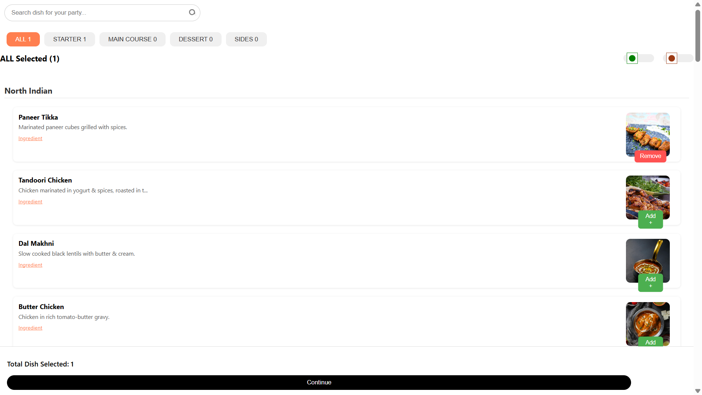

# 🍽️ Party Menu Selection App (TheChefkart Assignment)

A ReactJS web application where users can browse a categorized menu of dishes, filter them, and select items for a party.

🚀 **Live Demo**: [party-menu-app.surge.sh](https://party-menu-app.surge.sh/)  
📦 **Repository**: [GitHub Repo](https://github.com/rojanagunoori/party-menu-app.git)

---

## 📖 Project Overview
The goal of this assignment is to build a **Party Menu Selection App**.  
Users can:
- Browse a categorized menu of dishes
- Filter them by type or search
- Add/remove dishes for a party menu
- View ingredients for each dish in detail

---

## ⚙️ Installation & Setup

### Clone the Repository

git clone https://github.com/rojanagunoori/party-menu-app.git
cd party-menu-app
## Install Dependencies

npm install
Run Locally

npm start
The app will open at 👉 http://localhost:3000

🏗️ Project Structure
text
Copy code
party-menu-app/
└── src/
    ├── components/
    │   ├── DishCard.js
    │   ├── DishList.js
    │   ├── Filters.js
    │   └── IngredientModal.js
    ├── data/
    │   └── mockDishes.js
    ├── App.css
    └── App.js
📦 Deployment (Surge.sh)
This project is deployed using Surge.

Steps:
Install Surge globally (only once):

npm install --global surge
Build the app for production:

npm run build
Deploy with Surge:

surge ./build party-menu-app.surge.sh
Open the live app at 👉 party-menu-app.surge.sh

🎨 Styling (Example CSS)
css
Copy code
body {
  font-family: Arial, sans-serif;
  background-color: #f4f4f4;
}

.dish-card {
  border: 1px solid #ddd;
  border-radius: 8px;
  padding: 15px;
  margin: 10px;
  background-color: white;
  box-shadow: 0 2px 4px rgba(0,0,0,0.1);
}
🔄 App Flow
User selects a category → Updates selectedCategory in state

App filters dishes → Passes filteredDishes to DishList

User searches or toggles Veg-only → State updates & UI re-renders

Add/Remove dish → Updates selectedDishes state

Ingredients → Opens modal with detailed dish info

✅ Deliverables
Public GitHub repository with full ReactJS code

Functional web app with:

Dish listing & categories

Search + Veg/Non-Veg filter

Add/Remove selection

Ingredient modal

Deployment live on Surge.sh

📸 Screenshots
(Add your app screenshots here)

👨‍💻 Author
Rojan Agunoori
🔗 GitHub

pgsql
Copy code

---

👉 Now your README will show **clear sections with headings** (`##` and `###`) instead of looking like plain text.  

Do you want me to also **add emoji icons** (like ✅, ⚡, 🏗️) to each heading so it looks more modern and eye-catching?

Ask ChatGPT
